# 🛍️ Mini Store

متجر إلكتروني مصغر تم تطويره باستخدام **ASP.NET Core MVC** و **Entity Framework Core** و **SQL Server**، ويهدف إلى تطبيق مفاهيم MVC وبناء لوحة تحكم متكاملة لإدارة المنتجات مع واجهة حديثة باستخدام Bootstrap 5.

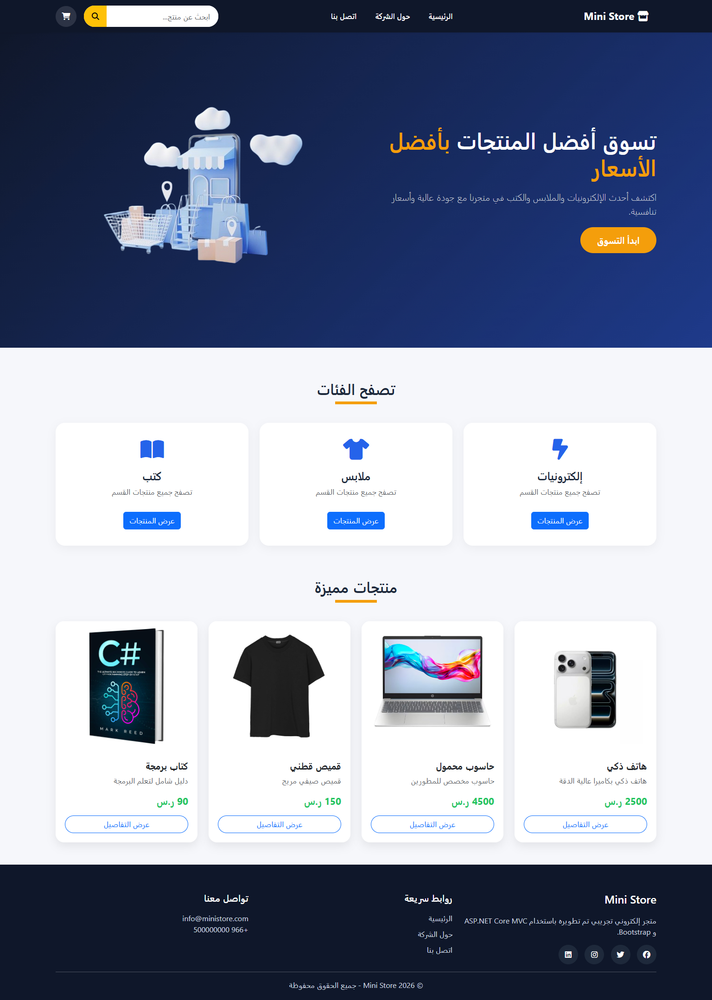

---

# 📖 نبذة عن المشروع

يحتوي المشروع على متجر إلكتروني لعرض المنتجات بالإضافة إلى لوحة تحكم (Dashboard) لإدارة المنتجات وربطها بالفئات باستخدام قاعدة بيانات SQL Server.

يمكن للمستخدم:

- تصفح المنتجات.
- البحث عن المنتجات.
- عرض تفاصيل المنتج.
- تصفح الصفحات الثابتة.
- إدارة المنتجات من لوحة التحكم.

---

#  المميزات

-  عرض جميع المنتجات.
-  عرض تفاصيل المنتج.
-  إضافة منتج جديد.
-  تعديل بيانات المنتج.
-  حذف منتج مع رسالة تأكيد.
-  تصنيف المنتجات حسب الفئة.
-  One-to-Many Relationship بين Products و Categories.
-  البحث عن المنتجات بالاسم.
-  Server-side Validation باستخدام Data Annotations.
-  دعم رفع صور المنتجات.
-  واجهة حديثة ومتجاوبة باستخدام Bootstrap 5.

---


## 📂 هيكل المشروع

```text
Mini-Store
│
├── Controllers
│   ├── HomeController.cs
│   └── ProductsController.cs
│
├── Data
│   └── AppDbContext.cs
│
├── Migrations
│
├── Models
│   ├── Category.cs
│   └── Product.cs
│
├── Properties
│
├── Screenshots
│   
├── Views
│   ├── Home
│   ├── Products
│   └── Shared
│
├── wwwroot
│   ├── css
│   ├── Images
│   ├── js
│   └── lib
│
├── appsettings.json
├── Program.cs
├── Mini-Store.csproj
└── README.md
```
--- 

# 📸 Screenshots

## 🏠 الصفحة الرئيسية


---

## 📂 صفحة المنتجات

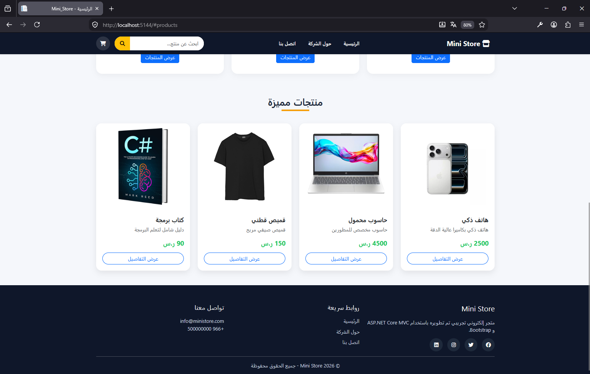

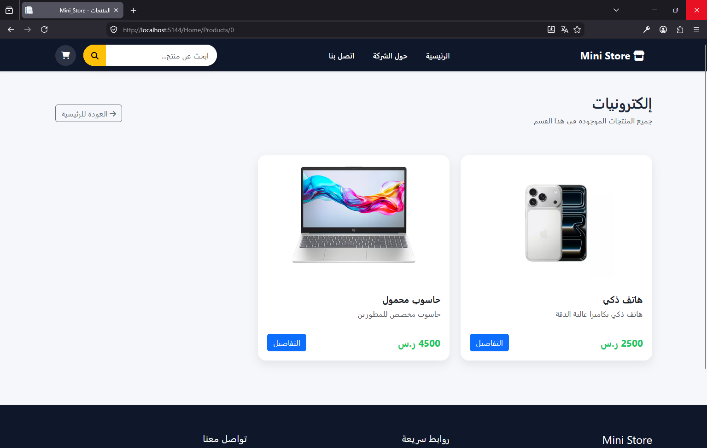

---

## 📄 صفحة تفاصيل المنتج

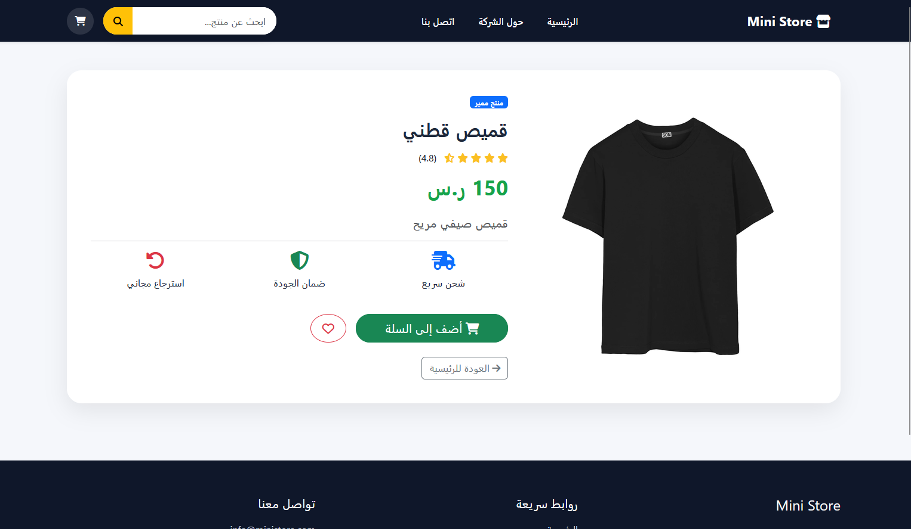

---
---

## 🏢 صفحة حول الشركة

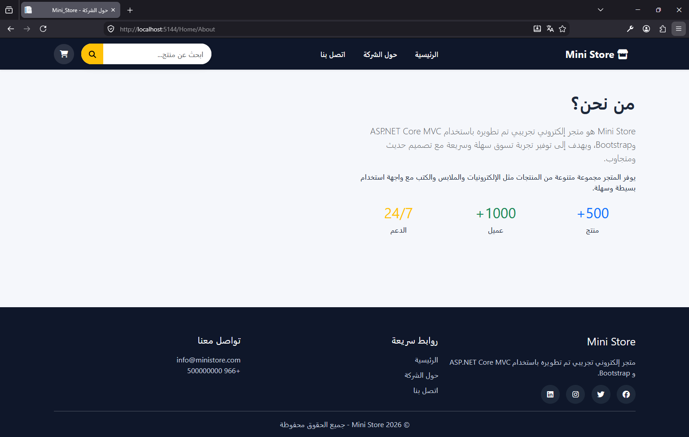

---

## 📞 صفحة اتصل بنا

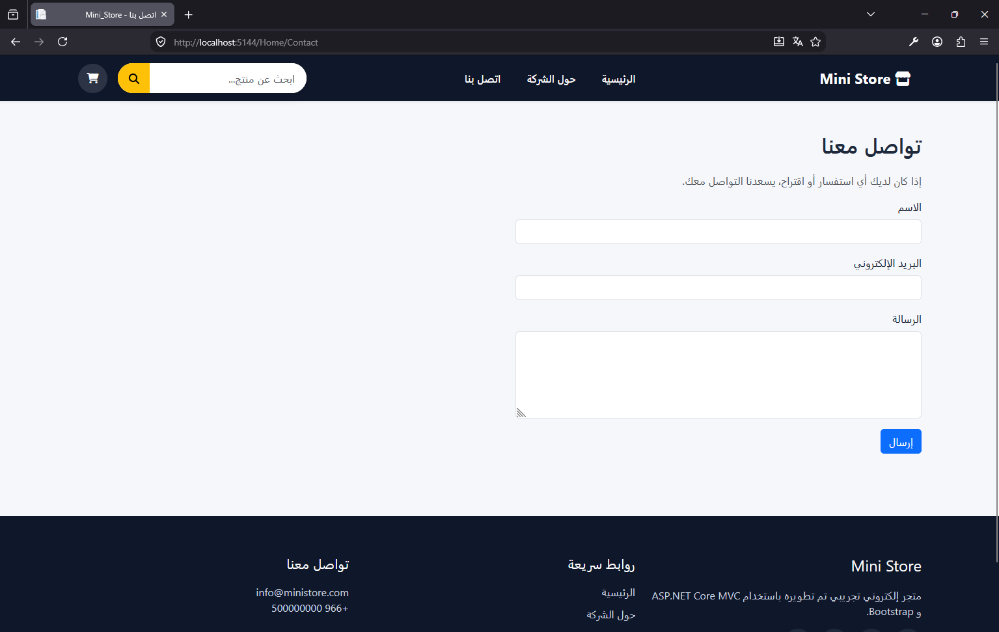

## 📊 لوحة التحكم

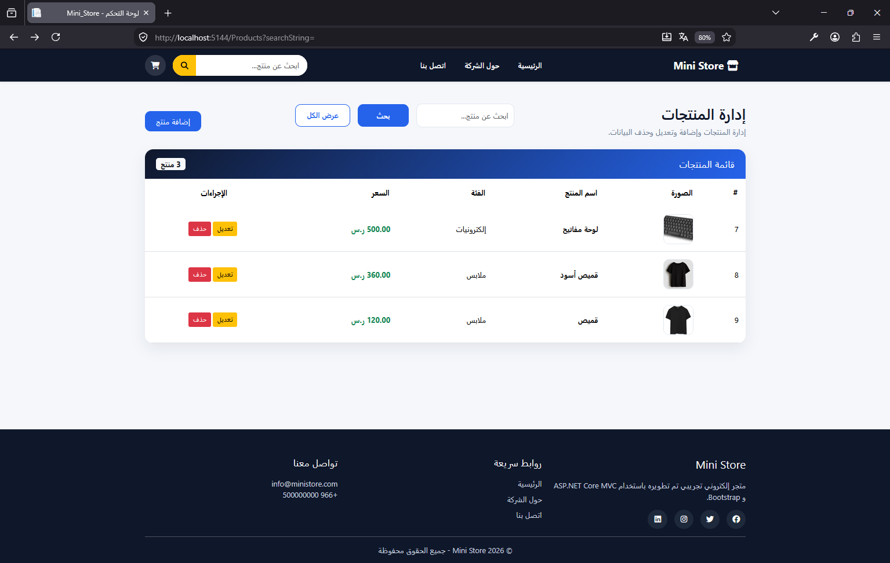

---

## ➕ إضافة منتج

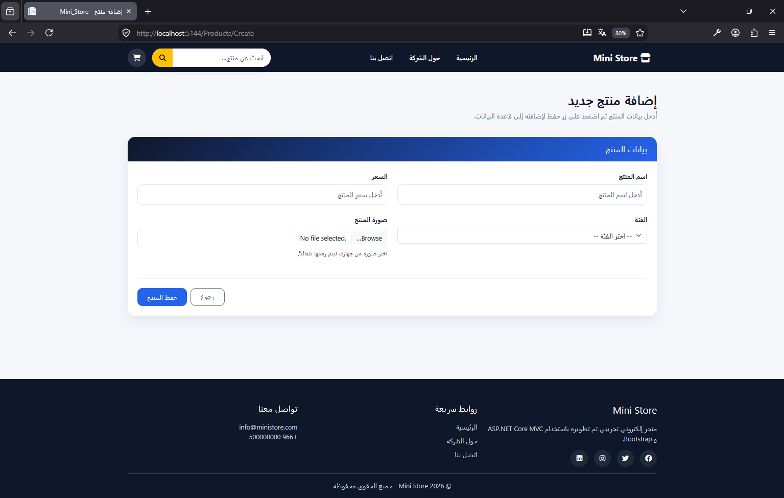

---

## ✏️ تعديل منتج

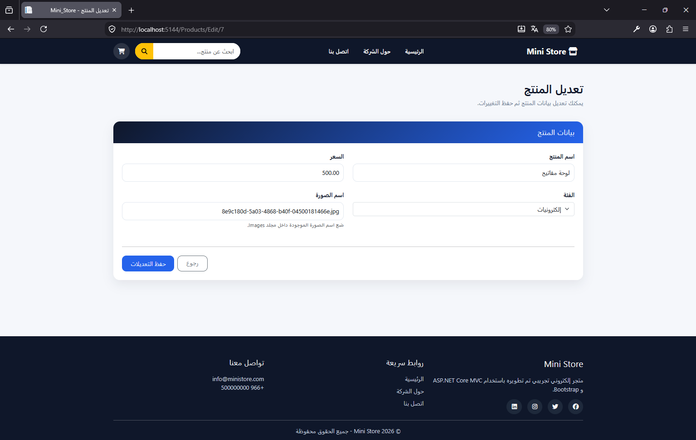

---

## 🗑️ حذف منتج

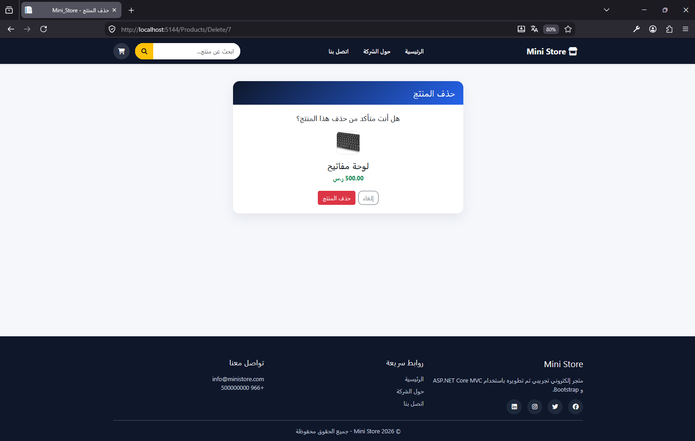

---

## 🔍 البحث عن المنتجات

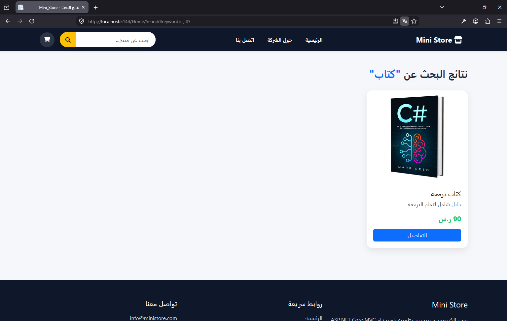

---

## ✅ التحقق من صحة البيانات


